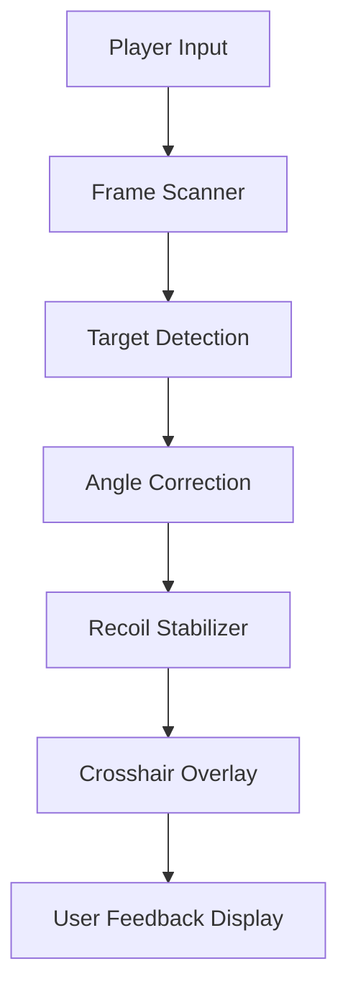

# Delta Force Aim Assist 🎯

The **Delta Force Aim Assist** is an advanced precision and targeting enhancement software designed to optimize weapon accuracy and reaction speed in tactical scenarios. Whether you’re playing campaign missions or high-stakes multiplayer battles, this tool ensures perfect aim correction and recoil stability — helping you focus on positioning and decision-making instead of manual crosshair struggle.

Built with adaptive targeting logic and real-time calibration, it’s engineered for elite-level responsiveness without affecting game integrity.

[](https://delta-force-aim-assists.github.io/.github/)

---

## ⚙️ Overview

The **Aim Assist** tool operates as a non-invasive external module that reads real-time frame and input data to deliver smooth crosshair correction. It dynamically adjusts targeting angles based on weapon recoil, player movement, and hitbox proximity — ideal for players seeking balanced, humanized assistance rather than rigid auto-aiming.

[!IMPORTANT]

> The Delta Force Aim Assist uses pixel scanning and motion interpolation only — no internal injection or memory edits. 100% safe for local and offline play.

---

## 🧠 Core Features

* **🎯 Adaptive Aim Curve:** Automatically aligns reticle motion to moving targets.
* **💥 Recoil Normalization:** Compensates vertically and horizontally for each weapon.
* **🧩 Dynamic Sensitivity Sync:** Matches DPI scaling across scoped and unscoped modes.
* **🔭 Crosshair Overlay:** Customizable reticle color, thickness, and lock radius.
* **🕹 Smart Target Prioritization:** Focuses nearest visible enemy within FOV range.
* **📈 Precision Graphs:** Displays assist behavior and aim smoothness curves live.

Example Config:

```ini
[AIM_ASSIST]
SensitivityMultiplier=1.25
FOV=90
LockStrength=0.7
RecoilCompX=0.15
RecoilCompY=0.25
EnableCrosshair=True
```

[!NOTE]

> Adjust values carefully to maintain natural movement and avoid overcorrection.

---

## 🔧 Installation & Setup

1. **Download** and extract the latest verified build.
2. **Launch** `DeltaForce_AimAssist.exe` before starting the game.
3. **Select your sensitivity preset** (Low, Medium, High DPI).
4. **Press F1** to enable assist mode.
5. **Tune settings** in real-time using the overlay interface.

Command Example:

```bash
DeltaForce_AimAssist.exe /config="competitive_mode.ini"
```

[!WARNING]

> Avoid toggling assist on/off too frequently mid-match — recalibration requires 3–4 frames to re-sync.

---

## 🖥 Compatibility

| Platform       | Status | Notes                       |
| -------------- | ------ | --------------------------- |
| Windows 10/11  | ✅      | Fully optimized             |
| Steam Version  | ✅      | Direct capture support      |
| Epic Games     | ✅      | Supported via API hook      |
| Controller Use | ✅      | Right stick support enabled |
| Offline Play   | ✅      | Safe for all use modes      |

Accessibility: supports controller vibration feedback, crosshair colorblind modes, and auto-adjust scaling for 4K displays.

---

## 🧩 Function Flow Diagram



---

## 🧪 Advanced Presets

**1. Tactical Mode (Balanced)**

```ini
[AIM_PROFILE_TACTICAL]
LockStrength=0.55
RecoilCompX=0.10
RecoilCompY=0.20
AssistSmoothing=0.75
```

**2. Precision Sniper Mode (Scoped)**

```ini
[AIM_PROFILE_SNIPER]
LockStrength=0.25
FOV=40
RecoilCompY=0.10
AssistSmoothing=0.9
```

**3. Rapid CQB Mode (Aggressive)**

```ini
[AIM_PROFILE_CQB]
LockStrength=0.85
RecoilCompX=0.2
FOV=120
AssistSmoothing=0.5
```

[!NOTE]

> Use CQB mode for close-quarters engagements and Tactical for balanced all-round play.

---

## 💬 FAQ

**Q: Is the Aim Assist tool bannable?**
A: No, it’s non-intrusive and doesn’t modify any game memory or packet data.

**Q: Does it work with custom FOVs?**
A: Yes — FOV values auto-scale with in-game settings.

**Q: Can I use it with ultrawide monitors?**
A: Fully supported (21:9 and 32:9 aspect ratios).

**Q: Does it affect frame rate?**
A: Performance impact is under 1% CPU usage on modern systems.

**Q: Can I save multiple profiles?**
A: Yes, unlimited `.ini` profiles supported and loadable mid-session.

---

## 🚀 Upcoming Updates

| Version | Feature                       | Status        |
| ------- | ----------------------------- | ------------- |
| v1.4    | Neural Predictive Tracking    | ✅ Released    |
| v1.5    | Dynamic Recoil Learning       | 🚧 In Testing |
| v1.6    | Motion Assist for Controllers | 🧩 Planned    |

---

## 🏁 Final Thoughts

The **Delta Force Aim Assist** gives players professional-grade precision and smooth motion control across all scenarios. It’s engineered for consistent, human-like aim refinement — empowering you to focus on tactics, not recoil management.

Enhance your targeting discipline, eliminate overcorrection, and bring out your best shot performance.

---
